# Honeypot Setup: T-Pot

## Table of Contents
- [Purpose](#purpose)
- [Utilities Used](#utilities-used)
- [Project Walkthrough](#project-walkthrough)
- [Findings](#findings)
- [Conclusion](#conclusion)

## Purpose
XXX

## Utilities Used
   
**Tool** - description
- bullet point
   
**Tool** - description
- bullet point

## Project Walkthrough

 Step 1: Deploy a virtual server on Vultr to host the honeypot 

 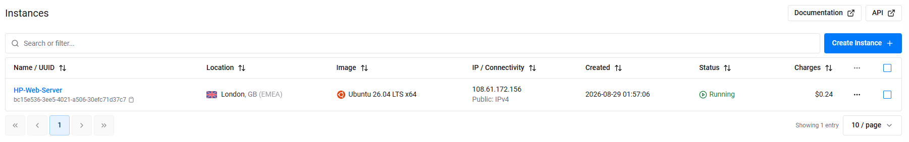 

 Step 2: SSH into the root account using the honeypot server's public IP address 

 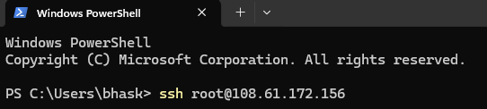 

 Step 3: Update and upgrade the repository 

  

 Step 4: Create a new user 

 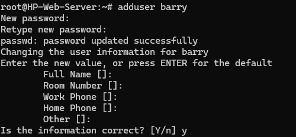 

 Step 5: Add the user to the sudo group to give it admin privileges 

  

 Step 6: Switch to the new user's account 

 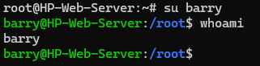 

 Step 7: Change to the user's home directory and clone the t-pot github repository 

 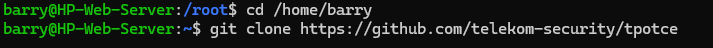 

 Step 8: Change into the tpotce directory 

 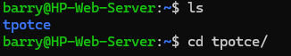 

 Step 9: Run install.sh 

 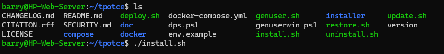 

 Step 10: Install the t-pot standard installation (h) 

 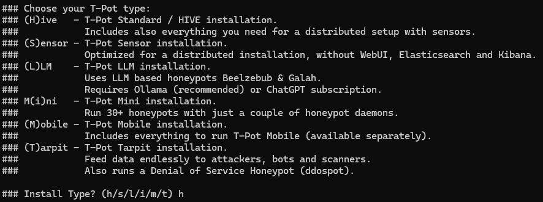 

 Step 11: Create a web user 

 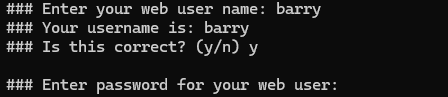 

 Step 12: Reboot the honeypot server 

 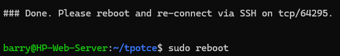 

 Step 13: Re-log into the honeypot server via the port 64295 

  

 Step 14: When checking the t-pot's status, it appears to have been stopped 

 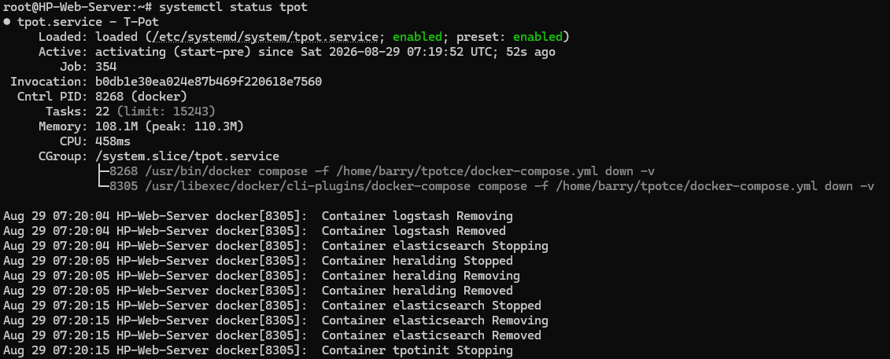 

 Step 15: Restart the t-pot 

  

 Step 16: Now, the t-pot is successfully started and running 

 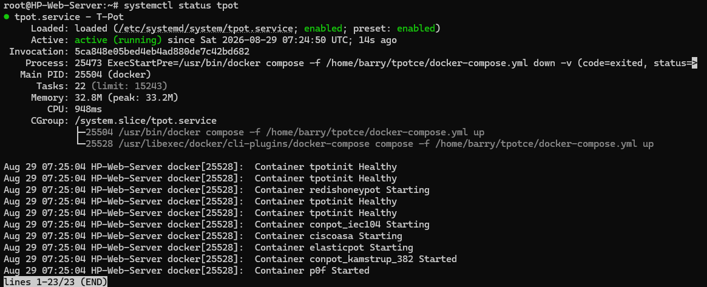 

 Step 17: Enter the honeypot's public IP and the port 64297 in a web browser 

  

 Step 18: Enter in the web user's credentials 

 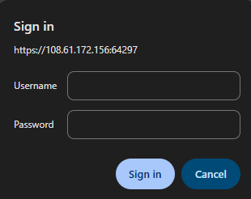 

 Step 19: The t-pot has been successfully deployed and accessed 

 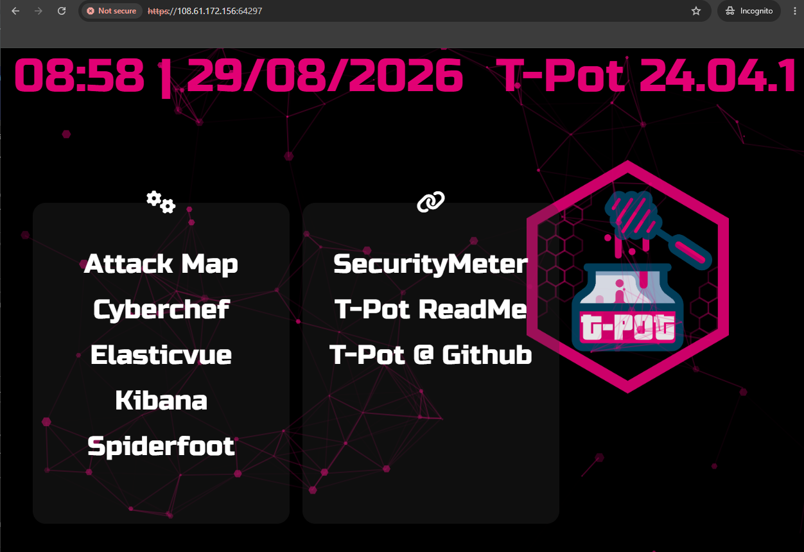 

 Step 20: Click into the Attack Map 

 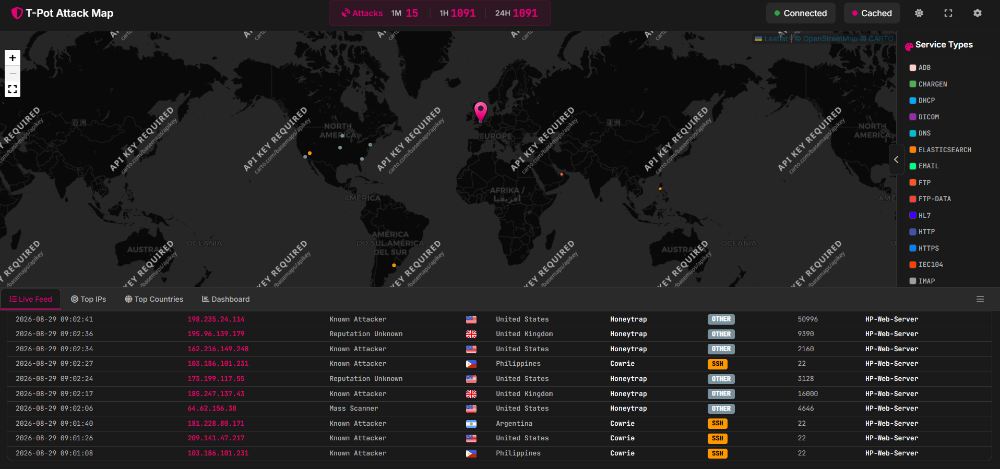 

 Step 21a: View the most common attacker 

 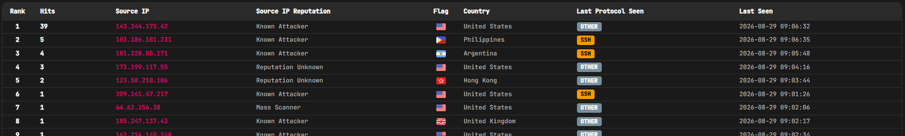 

 Step 21b: View where most attacks originate 

 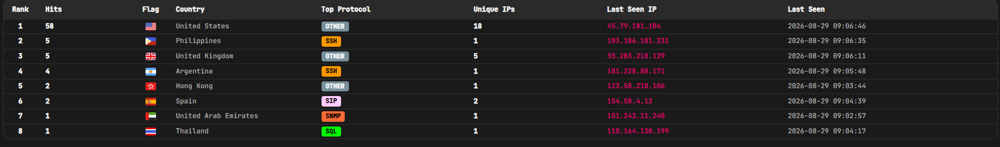 

 Step 21c: View the types of attacks 

 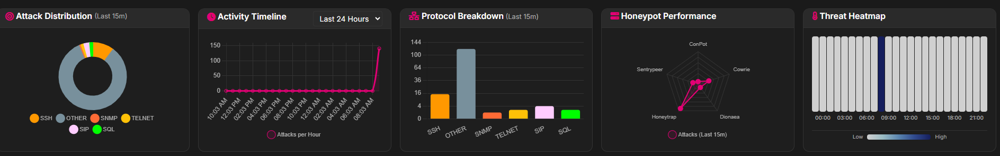 

## Findings
XXX

## Conclusion
XXX
